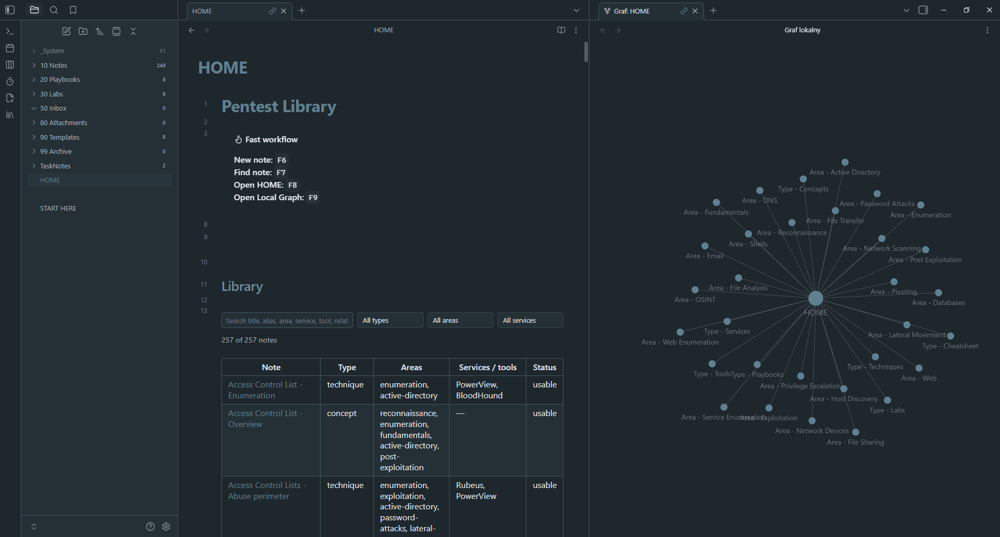
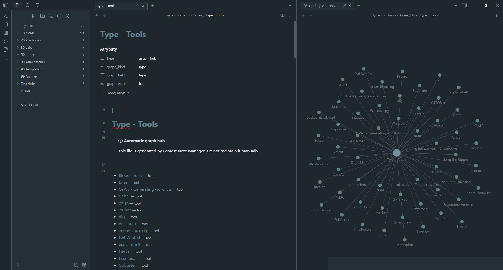
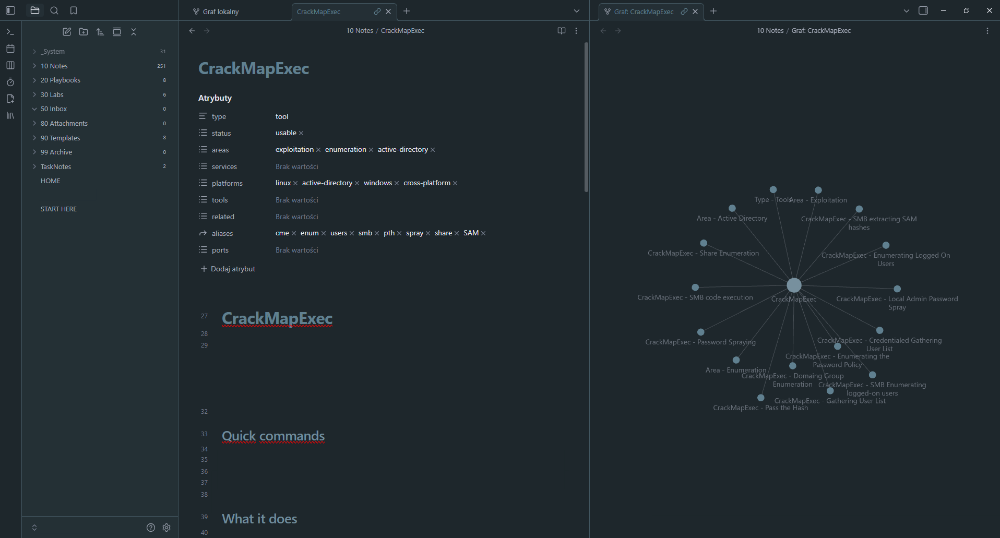
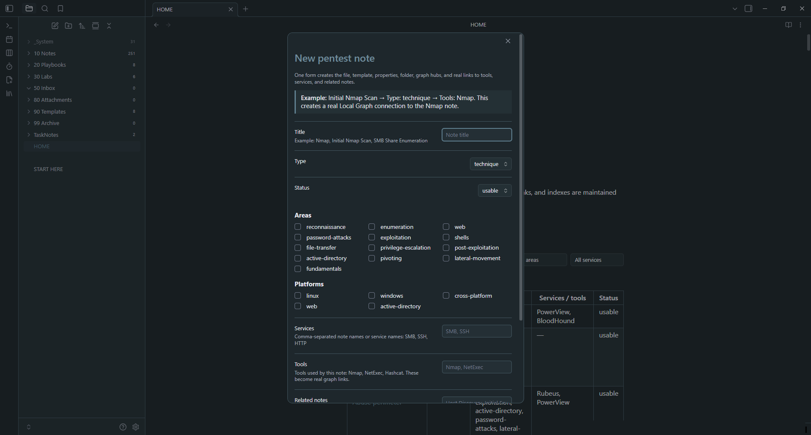

# 0xko1.sh Pentest Notes Vault

> [!NOTE]
> This repository contains an empty starter vault intended for building your own pentesting knowledge base.
>
> It includes the folder structure, templates, configuration, and Pentest Note Manager plugin, but does not include my personal pentesting notes.
>
> For obvious privacy and security reasons, my own notes, research, engagement data, credentials, targets, lab documentation, and other private material are not included.
>
> The vault provides the structure and tooling needed to create and organize your own notes.

## Screenshots

### Vault home

The home dashboard acts as the main entry point to the pentesting library. It provides quick access to notes, playbooks, labs, filters, and the automatically generated knowledge graph.

You can search the library directly from the table below using the search field and filters, or press `F7` to quickly find a specific pentest note.

For graph-based navigation, press `F9` while on the HOME note to open the Local Graph on the right side.

From there, you can navigate the vault visually by clicking directly on graph nodes. For example, selecting the `Type - Tools` node opens the automatically generated hub containing all notes classified as tools.



### Type - Tools hub

The `Type - Tools` hub is generated automatically by Pentest Note Manager and groups together every note classified as a tool.

When you open this node from the graph, the Local Graph updates and shows all tools connected to that category.

This allows you to browse the tool collection visually instead of searching through folders or note lists.

From here, you can select a specific tool node, such as `CrackMapExec`, and continue navigating deeper into the knowledge base.



### Tool relationships

After selecting a specific tool such as `CrackMapExec`, the Local Graph changes again and displays the notes directly related to that tool.

These relationships can include techniques, enumeration methods, credential attacks, execution methods, Active Directory topics, and other notes that reference or use the selected tool.

This creates a natural navigation flow through the vault:

`HOME` → `Type - Tools` → `CrackMapExec` → related notes

Instead of relying only on folders or search, you can explore the knowledge base by following relationships between topics, tools, techniques, services, and other notes.



### Creating a new pentest note

Press `F6` to create a new pentest note using the Pentest Note Manager plugin.

The creation form lets you define the note title, type, status, areas, platforms, services, tools, related notes, aliases, and other metadata.

Once the note is created, the appropriate template is inserted automatically and the note is immediately ready for writing.

Pentest Note Manager also takes care of the underlying structure automatically. Graph hubs, metadata relationships, tool and service connections, and related-note links are generated from the information provided in the form, so you do not have to maintain these connections manually.



## Structure

```text
10 Notes/         General pentesting notes
20 Playbooks/     Reusable attack and enumeration playbooks
30 Labs/          Lab and machine notes
50 Inbox/         Temporary notes
80 Attachments/   Images and other attachments
90 Templates/     Templates used by Pentest Note Manager
99 Archive/       Archived content
_System/          Automatically generated graph structure
```

## Included plugin

The vault includes the custom **Pentest Note Manager** Obsidian plugin.

It provides:

* creation of structured pentesting notes
* automatic frontmatter
* automatic graph connections
* note categories based on type and area
* tool and service relationships
* related-note discovery
* searchable pentesting library
* automatic graph hubs

## Getting started

1. Clone the repository:

```bash
git clone https://github.com/0xko1-git/0xko1.sh-vault.git
```

2. Open Obsidian.

3. Select **Open folder as vault**.

4. Choose the cloned folder.

5. Enable community plugins if Obsidian asks for permission.

6. Enable **Pentest Note Manager**.

7. Open `START HERE.md`.

## Keyboard shortcuts

| Key  | Action                    |
| ---- | ------------------------- |
| `F6` | Create a new pentest note |
| `F7` | Find a pentest note       |
| `F8` | Open the vault home       |
| `F9` | Open Local Graph          |

## Templates

The following note types are included:

* Tool
* Service
* Technique
* Concept
* Playbook
* Lab
* Cheatsheet

Templates are stored in:

```text
90 Templates/
```

## Privacy

This repository contains an empty starter vault.

It does **not** contain pentest results, credentials, targets, client data, lab notes, API keys, tokens, or other sensitive information.

When using this vault for real engagements, review your notes carefully before committing or publishing them.

## Important

Back up your Obsidian vault before using the plugin with important data.

This project is provided as-is and is used at your own risk. The authors are not responsible for data loss, corrupted notes, broken vaults, or other damage resulting from use of the project.

## Disclaimer

This project is intended for:

* authorized penetration testing
* security research
* CTFs
* labs
* education

Only perform security testing against systems you own or have explicit permission to test.

## License

MIT License. See [LICENSE](LICENSE).

